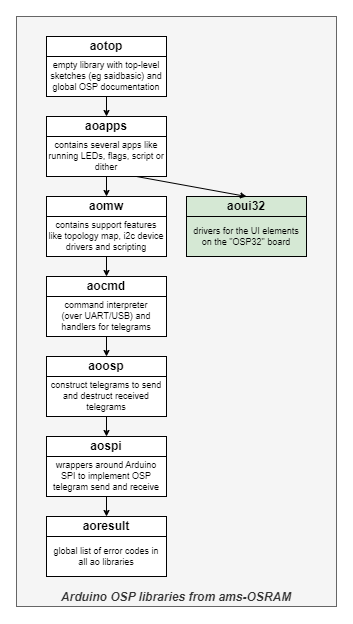
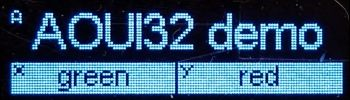
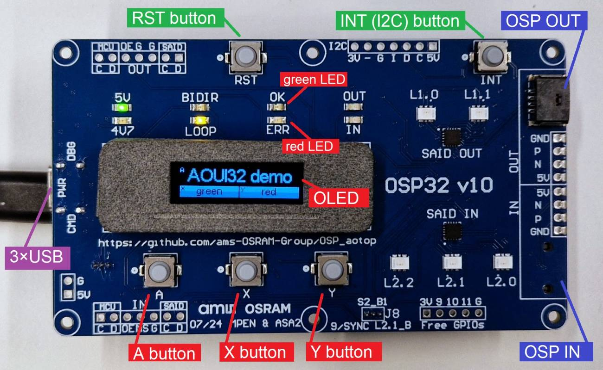
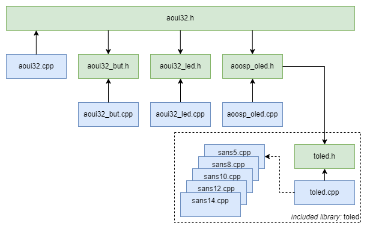
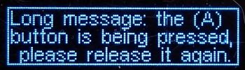
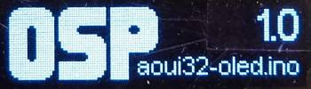
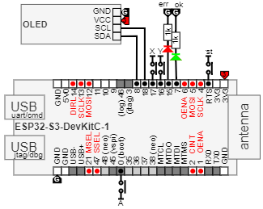

# OSP UIDriversOSP32 aoui32

Library "OSP UIDriversOSP32 aoui32", usually abbreviated to "aoui32", 
is one of the **aolibs**; short for Arduino OSP libraries from ams-OSRAM.
This suite implements support for chips that use the Open System Protocol, 
like the AS1163 ("SAID") or the OSIRE E3731i ("RGBi").
The landing page for the _aolibs_ is on 
[GitHub](https://github.com/ams-OSRAM-Group/OSP_aotop).

## Introduction

Library _aoui32_ contains drivers for the UI elements on the OSP32 board. 
As a result, library _aoui32_ does not depend on the other _aolibs_,
only on the Arduino API (GPIO pins and I2C). It can be used in isolation.

### UI Elements 
This library drives the following elements.

 - A, X, and Y button
 - red and green signaling LED
 - 128×32 OLED

The (OLED) display is intentionally small to only feedback a minimum of information.
The intention is that the screen shows the "application state":
 - Which app is running (its name);  the A button selects next app.
 - What the X and Y button do in the current app.

### Board

The image below shows the OSP32 board with the UI elements highlighted in red.

## Examples

This library comes with the following examples.
You can find them in the Arduino IDE via 
File > Examples > OSP UIDriversOSP32 aoui32 > ...

- **aoui32_but** ([source](examples/aoui32_but))  
  This demonstrates how to detect button presses and button releases of the
  buttons on the OSP32 board. The library can report the transitions (events
  like button _going_ down or _going_ up), not just the button _being_ down 
  or _being_ up.

- **aoui32_led** ([source](examples/aoui32_led))  
  This demo shows the various ways the signaling LEDs on the OSP32 board 
  can be controlled: on/off/toggle, changing a single or both LEDs.

- **aoui32_oled** ([source](examples/aoui32_oled))  
  This demo demonstrates the OLED on the OSP32 board. Button A controls the 
  OLED contents, and buttons X and Y control the green and red signaling LED. 
  This demo also has a splash screen.

## Module architecture

This library contains 3 modules, see figure below (arrows indicate #include).

- **aoui32_but** (`aoui32_but.cpp` and `aoui32_but.h`) is a small module that implements 
  functions to check for button (A, X, Y) _transitions_ ("went down").

- **aoui32_led** (`aoui32_led.cpp` and `aoui32_led.h`) is a small module that implements 
  functions to switch one or more signaling LEDs (the red and/or the green one) 
  on or off (or toggle).

- **aoui32_oled** (`aoui32_oled.cpp` and `aoui32_oled.h`) is a small module that implements 
  some wrapper functions on top of a library for an OLED display. The wrapper uses the 
  [Tiny OLED library](https://github.com/maarten-pennings/toled/) (toled).
  The _aoui32_ library comes with a [copy](src/toled) of toled included, to ensure there
  are no versioning issues. The included library is a single module (c/h file),
  but it comes with 5 extra files, each implementing a font of some size.

## API

The header [aoui32.h](src/aoui32.h) contains the API of this library.
It includes the module headers [aoui32_but.h](src/aoui32_but.h), [aoui32_led.h](src/aoui32_led.h), 
and [aoui32_oled.h](src/aoui32_oled.h).
The headers contain little documentation; for that see the module source files. 

### aoui32

- `aoui32_init()` initializes the button and led pins and configures the OLED.
- `AOUI32_VERSION`  identifies the version of the library.

### aoui32_but

- `aoui32_but_scan()` must be called regularly - see "Execution architecture".
- `aoui32_but_isup(buts)` and `aoui32_but_isdown(buts)` check the current button state (a mask of buttons can be passed).
- `aoui32_but_wentdown(buts)` and `aoui32_but_wentup(buts)` check button transitions (a mask of buttons can be passed).

### aoui32_led

- `aoui32_led_on(leds)`     switches all passed LEDs (mask) on.
- `aoui32_led_off(leds)`    switches all passed LEDs (mask) off.
- `aoui32_led_toggle(leds)` toggles all passed LEDs (mask).

### aoui32_oled

- `aoui32_oled_state(name,xlbl,ylbl)` shows a screen with three fields: 
  app name, function of X button, and function of Y button.
 
  

- `aoui32_oled_msg(msg)` shows a full screen (error) message in sans5 font.
 
  

- `aoui32_oled_splash(name,version)` shows a splash screen with name and version 
  of executable (and the OSP "logo").

  

- It should be noted that header "aoui32.h" includes "toled.h", so all low level primitives of the
  underlying OLED driver (toled) are also available to an application using library _aoui32_.

## Schematics

The _aoui32_ lib assumes a fixed wiring for the buttons (A, X, and Y), 
signaling LEDs (red/error, green/ok), and the OLED. The OLED is assumed
to be of resolution 128×32 pixels, and driven by an SSD1306 controller. 

## Execution architecture

### Buttons

The buttons require a regular call to `aoui32_but_scan()`. The module keeps the last two
scan results (i.e. the button states), and with that it can determine a `aoui32_but_wentdown()` 
or `aoui32_but_wentup()` transition.

Call `aoui32_but_scan()` frequently, say at least every 100ms, but preferably more often, for a smooth UI.
To prevent picking up contact bounce, too frequent calls are ignored (see constant `AOUI32_BUT_BOUNCE_MS`).

### OLED

The OLED module keeps a 128×32 pixel monochrome frame buffer in which all draw operations take place.
The function `toled_clear()` erases the frame buffer. 
The function `toled_commit()` sends the frame buffer, all 4096 pixels (512 bytes), 
over I2C to the OLED. The OLED has a 1MHz I2C connection, which one might hope 
results in a transfer time of 128×32/1M = 4096 µs. In practice the transfer time is 6000 µs.

Drawing a near full-screen rectangle on an ESP32S3 takes 45 µs (not even 1% of the transfer time), 
and drawing some text takes 340 µs (6% of the transfer time). These figures come from the
[toled](https://github.com/maarten-pennings/toled/blob/main/example/toled-speed/toled-speed.ino)
library.

| action           | time (µs) | % of transfer |
|:-----------------|:---------:|:-------------:|
| draw rectangle   |      45   |           1   |
| draw text        |     340   |           6   |
| transfer to OLED |    6000   |         100   |

## Version history _aoui32_

- **2024 sep 6, 0.3.7**
  - Updated description in two examples.
  - Updated `readme.md`.

- **2024 sep 5, 0.3.6**  
  - Replaced OSP32 photo.
  - API section in readme now shows parameter names.
  - Added links in `readme.md` for all example sketches.
  - Corrected link to GitHub from aotop to OSP_aotop.
  - Remove "oalib" from `sentence=` in `library.properties`.
  - Arduino name changed from `OSP Drivers UI OSP32 board - aoui32` to `OSP UIDriversOSP32 aoui32`.
  - Renamed dir `extra` to `extras`.
  - `license.txt`, `examples\xxx.ino` line endings changed from LF to CR+LF.

- **2024 Jul 02, 0.3.5**  
  - Initial release candidate.

(end)
